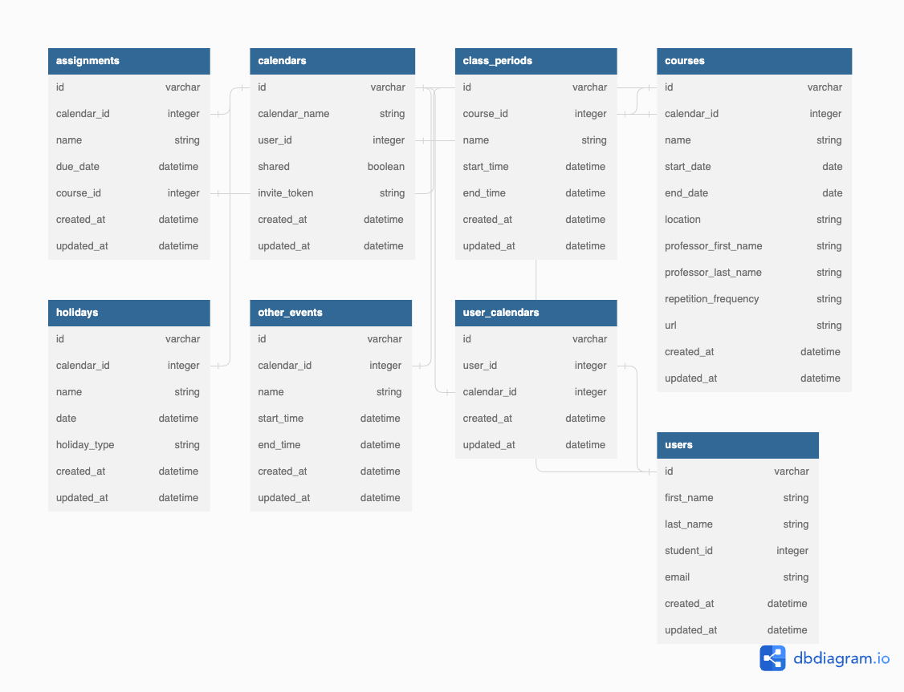
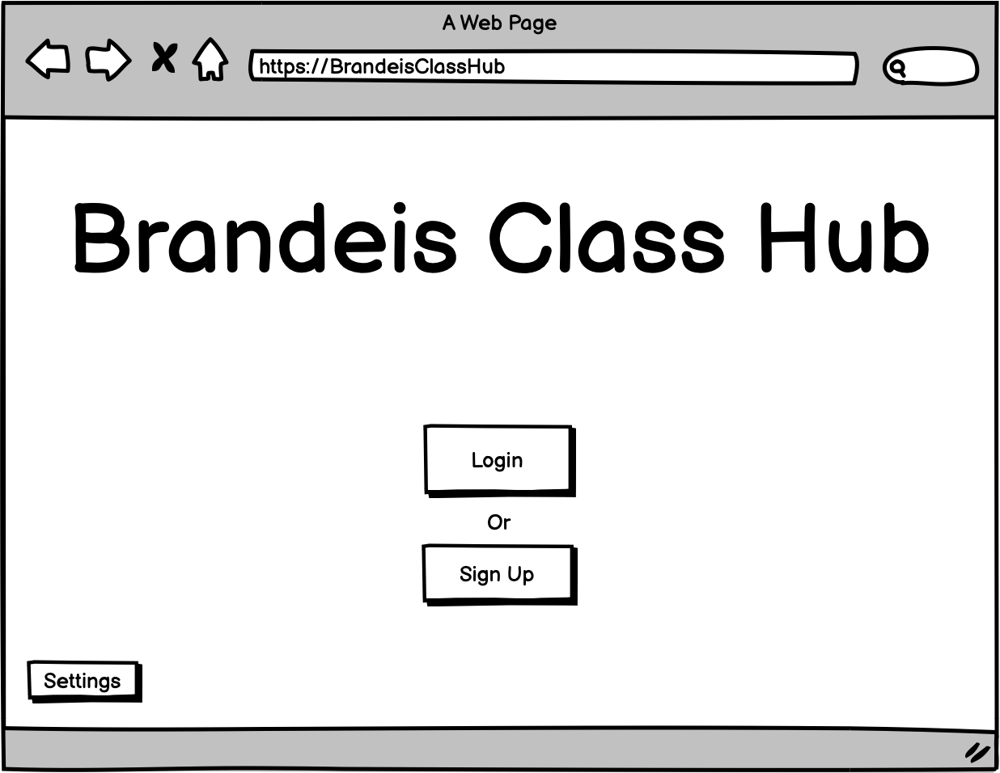
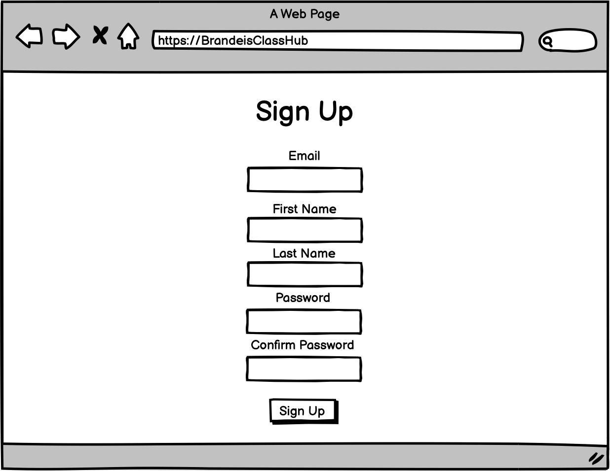
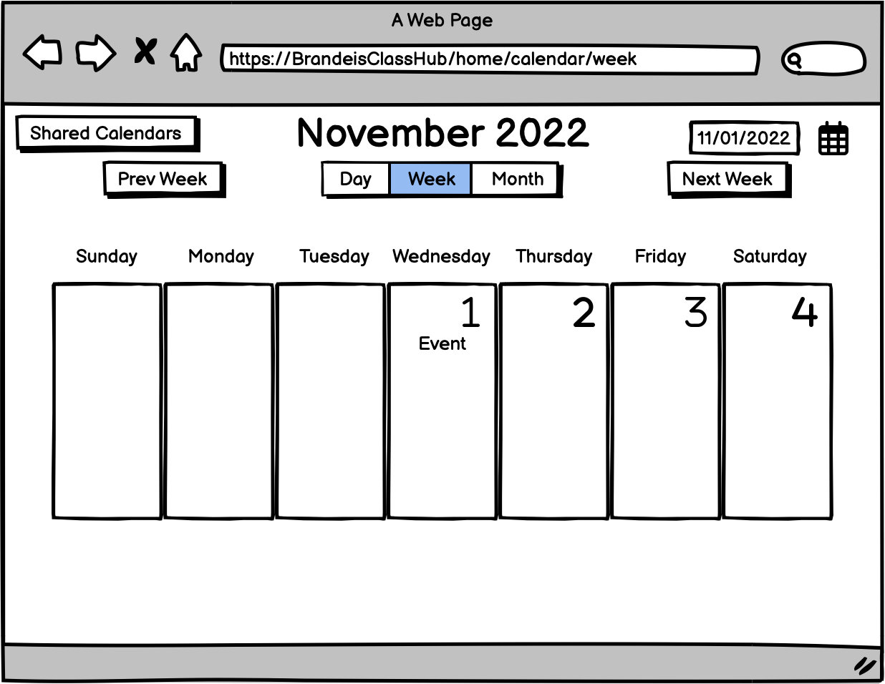
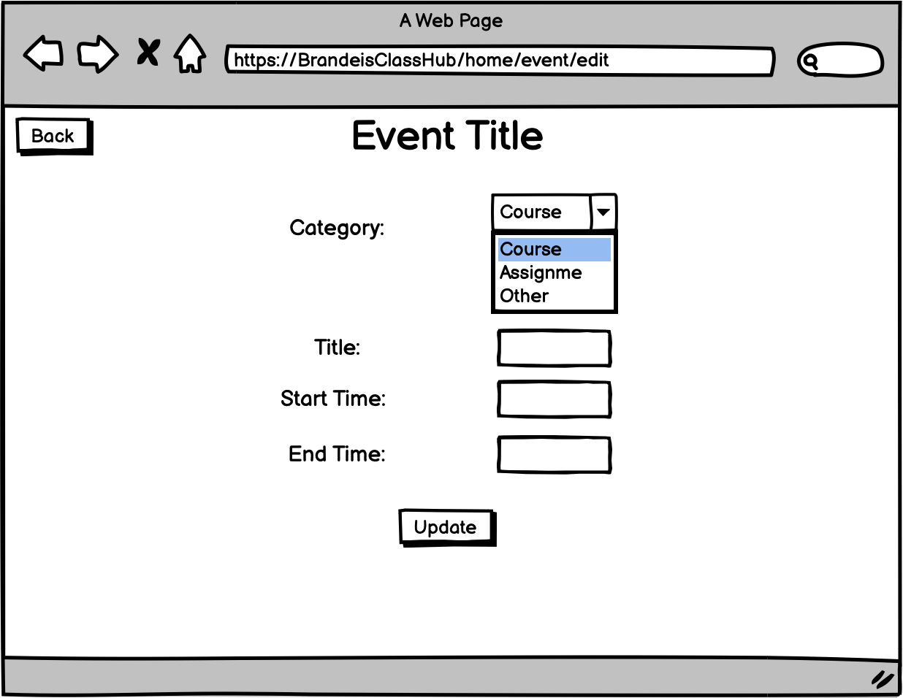
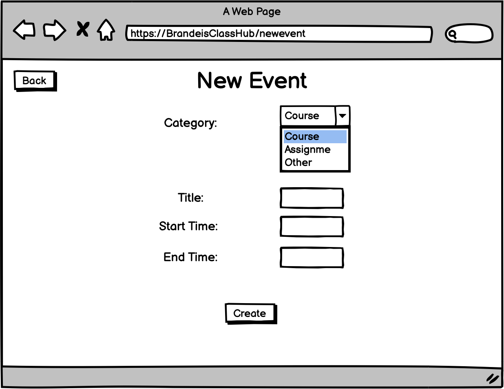
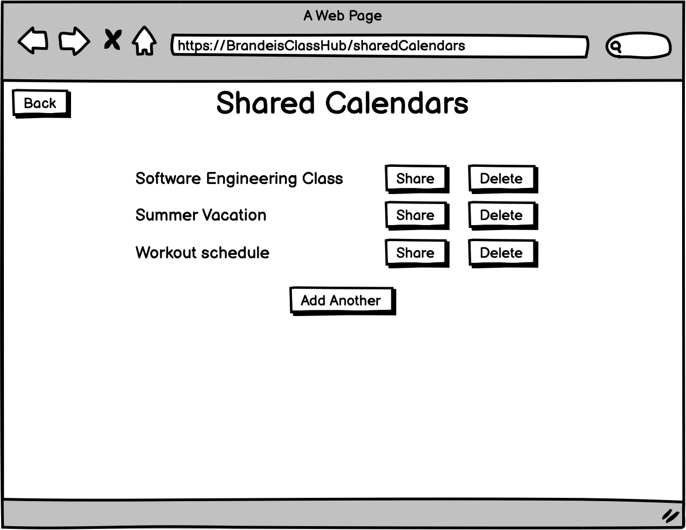

# Brandeis Class Hub

### Project Name, Team Name/Number and Team Members
- Project Team: Brandeis Class Hub
- Team Name: Team Three
- Team Number: 3
- Team Members: Jason Gordon, Lu Hao, Jiefang Li, David Shapiro

### Summary of functionality
Generally, our functionality so far is making events for the calendar, sharing calendars, and switching views/months. Most of our calendar and shared calendar functionality is up, and you can schedule and create events accordingly. You can share these calendars via link and have other people see them as well.

### Trello Link
https://trello.com/b/heBEa0Pv/main

### Heroku Link
https://safe-woodland-06100.herokuapp.com/

### URL patterns
**Root (/):** This gives the base view of the app, currently just our logo and a button to log in/sign up.

**Calendar Routes:**
- Route: */calendars* - /calendars refers to a single calendar.
- Methods: *#index*, *#create*
  - #index shows the current calendars.
  - #create allows the user to create a new calendar; it renders /new.
- Sub-routes on /calendar: */new*, */:id* 
  - /:id refers to the specific calendar.
  - Methods on /:id - *#show*, *#update*, *#destroy*
    - #show shows the current calendar.
    - #update updates the current calendar.
    - #destroy deletes the current calendar.
  - Sub-route on /:id - /edit, which changes the settings on the current calendar.
  
**Event Routes**
- Routes: */events*, */holidays*, */class_periods*, */courses*, */assignments*
  - All of these have the same methods, but are different types of event.
- Methods on the event routes: *#index*, *#create*
  - #index shows all events a user has of the specified type.
  - #create makes a new event of the specified type, it renders /new.
- Sub-routes for all event routes: */new*, */:id*
  - /:id refers to the specific event.
  - Method on /:id - *#show*: This displays the event.
  - Sub-route on /:id - */edit*: This allows a user to edit the event.
  
**Sign-up/Login Routes**
- Routes: */users*, */signup*, */login*, */logout*
    - /signup creates a new User and allows a user to sign up for the service. It uses the method users#new.
    - /login creates a new session and logs in the user. It uses sessions#new and sessions#create to do this.
    - /logout closes the session and logs out the user via sessions#destroy.
    - /users refers to all of the users.
      - Method on /users: *#index*, which shows all users.
      - Sub-route on /users: */:id*, which refers to a single user.
        - Methods on /:id - *#show*, *#update*, *#destroy*
          - #show displays the user
          - #update updates the user via /edit.
          - #destroy deletes the user.
        - Sub-route on /:id - */edit*, which is a page that updates the user.


### Schema


### Planned views
- Sign up page and login page for users. 
- Calendar home view where users can switch between days, weeks and months.
- Shared calendar view where users can create a calendar, edit a shared calendar, either shared or not.
- Event view is built on calendar view, where users can create an event on a calendar. Based on the event category, assignment view, holiday view and other events view loads where users can put in detailed information for each event.

### List of our dependencies on APIs, gems, libraries and so on
- gem 'rails', '~> 7.0.4'
- gem 'bootstrap-sass', '3.4.1'
- gem 'sprockets-rails'
- gem 'pg', '~> 1.1'
- gem 'puma', '~> 5.0'
- gem 'importmap-rails'
- gem 'turbo-rails'
- gem 'stimulus-rails'
- gem 'devise_invitable', '~> 2.0.0'
- gem 'jbuilder'
- gem 'faker', git: 'https://github.com/faker-ruby/faker.git', branch: 'master'
- gem 'tzinfo-data', platforms: %i[mingw mswin x64_mingw jruby]
- gem 'bootsnap', require: false
- gem 'bootstrap-sass', '3.4.1'
- gem 'debug', platforms: %i[mri mingw x64_mingw]
- gem 'web-console'
- gem 'capybara'
- gem 'selenium-webdriver'
- gem 'webdrivers'

### Instruction to run test
```
rails test
```

### Prototype











