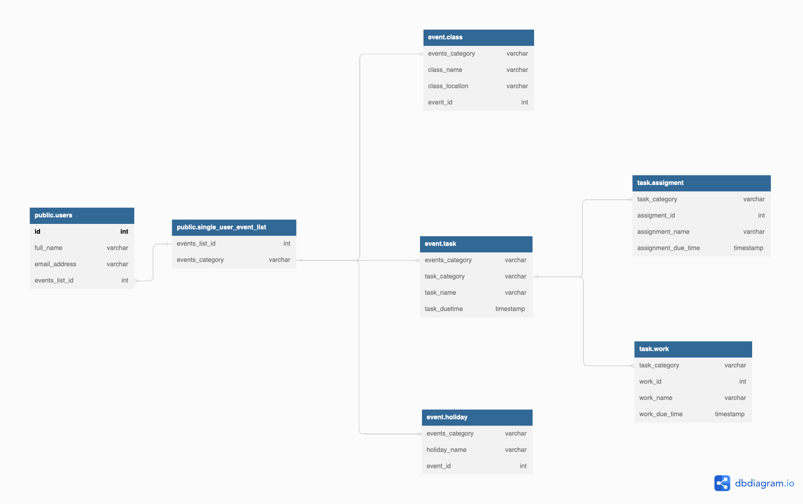
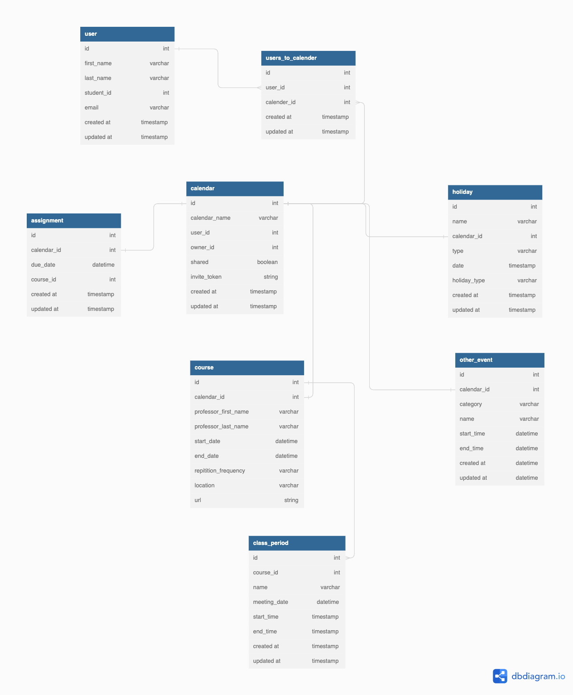

# Brandeis Class Hub

Lu Hao, David Shapiro, Jiefang Li, Jason Gordon

### Summary

Generally, our product is a merger of a calendar and a ToDo/Task Manager App. We'll use Brandeis' APIs and Workday's .csv exporting capabilities to organize where classes are, when classes are, and display this all on a calendar including Brandeis Holidays. We'll also allow users to create tasks and put them on a calendar and in a To-Do list with alarms, alerting the users when the task they need is. They can also set alarms independently to the calendar for class reminders.

### Trello Link

https://trello.com/b/heBEa0Pv/main

### Heroku Link

https://fast-refuge-01044.herokuapp.com/

### General Areas of Focus

Jiefang is interested in working on the backend, making and managing the database.
Lu is going to work on the front-end, working with rails to create the calendar and to-do display.
David is interested in working on UI design in addition to making front-end object models such as for our classes, tasks, users, etc.
Jason is interested in working on the general structure of the app and will be working on getting the course listing API and CSV file reader working.

### Schema as of 19 September 2022

Above is our db diagram.
- Every user will have an event list, which is one-to-one relationship. 
- Every event list contains multiple sub-event list (i.e., different kind of events), which is one-to-many relationship. 
  - However, if we focus on the relationship between a single-user-event-list and a single event category, it will be a one-to-one relationship as each single-user-event-list will only contain a class/task/holiday list and a single user's class/task/holiday list will only belong to a single-user-event-list. (i.e., there won't be two event.class lists in a single-user-event-list). 
- Every task contains different kind of sub-categories so it's also a one-to-many relationship. 

